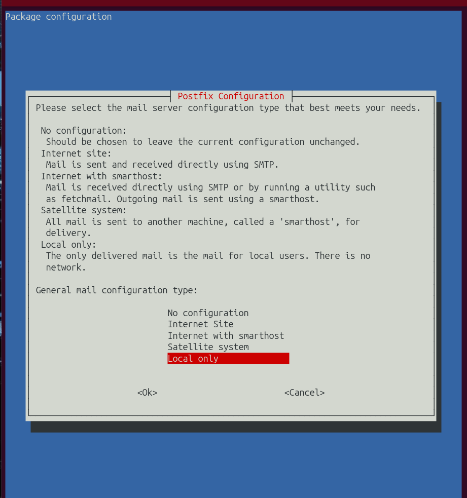
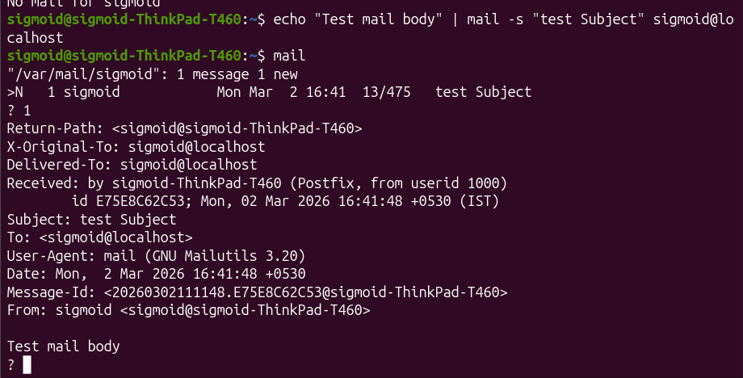
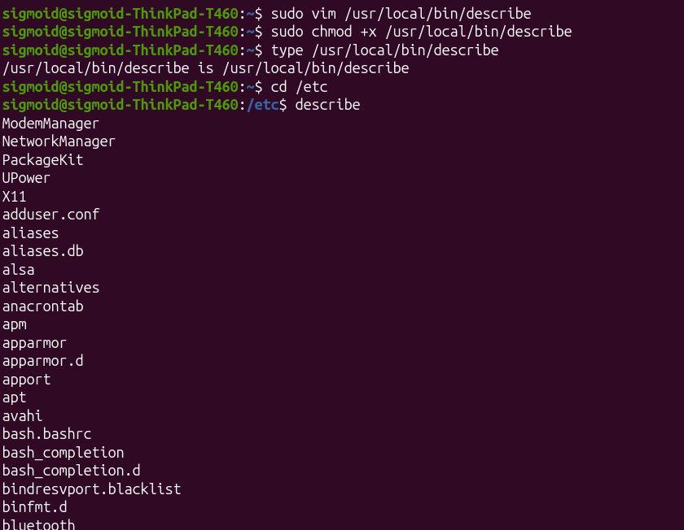

# Linux_Assignment

### Name: Siddharth Prabhudesai
### Mail: siddharth.vishwanath@sigmoidanalytics.com
### ID: TSV-919


```bash 
sudo apt update
sudo apt install postfix
sudo nano /etc/mailname
cat /etc/mailname
postconf myhostname
sudo postconf -e "myhostname = localhost"
sudo systemctl restart postfix
sudo systemctl status postfix
sudo apt install mailutils
which mail
echo "Test Mail Body" | mail -s "Test Subject" sigmoid@localhost
ls /var/mail/
cat /var/mail/sigmoid

sudo adduser testinglinuxassignment
getent passwd testinglinuxassignment
groups testinglinuxassignment

sudo nano /usr/local/bin/describe
sudo chmod +x /usr/local/bin/describe
describe

cd ~/Desktop/SigmoidIntern/LinuxTut
touch research.txt
touch research.hello
tar -cvzf research.tar.gz research.txt research.hello
sudo find / -type f -name "research.*"
file research.tar.gz
tar -xzvf research.tar.gz
mkdir research_extract
tar -xzvf research.tar.gz -C research_extract
ls research_extract

sudo nano /etc/profile
source /etc/profile
touch restrictedfile
ls -l restrictedfile

sudo nano /usr/local/bin/showtime.sh
sudo chmod +x /usr/local/bin/showtime.sh
sudo nano /etc/systemd/system/showtime.service
sudo systemctl daemon-reload
sudo systemctl start showtime
sudo systemctl status showtime
cat ~/showtime.txt
sudo systemctl stop showtime

```
##Scripts:
### Showtime
```bash
[Unit]
Description=Show Time Every Minute

[Service]
ExecStart=/usr/local/bin/showtime.sh
User=sigmoid
Restart=always

[Install]
WantedBy=multi-user.target

```








